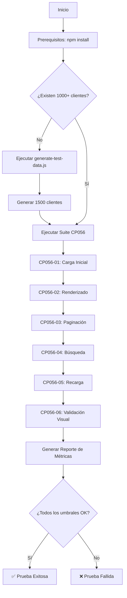

# CP056 - Documentación Técnica Completa

## 📑 Índice

1. [Descripción General](#descripción-general)
2. [Arquitectura de la Prueba](#arquitectura-de-la-prueba)
3. [Especificación Técnica](#especificación-técnica)
4. [Métricas y Umbrales](#métricas-y-umbrales)
5. [Implementación Detallada](#implementación-detallada)
6. [Análisis de Resultados](#análisis-de-resultados)
7. [Optimizaciones Recomendadas](#optimizaciones-recomendadas)

---

## 📖 Descripción General

### Propósito

CP056 evalúa el **rendimiento de renderizado de la tabla de clientes** del sistema IDURAR ERP/CRM cuando contiene más de 1000 registros. El objetivo es identificar cuellos de botella en el frontend y asegurar una experiencia de usuario fluida con grandes volúmenes de datos.

### Alcance

- **Componente Bajo Prueba**: Módulo de Clientes (`/customer`)
- **Framework de UI**: React + Ant Design (tabla con paginación)
- **Herramienta de Prueba**: Playwright (automatización de navegador)
- **Dataset**: 1000-1500 registros de clientes ficticios
- **Tipo de Prueba**: No funcional - Rendimiento de UI

### Contexto del Sistema

```
Frontend (React)                Backend (Node.js + Express)         Database (MongoDB)
┌──────────────────┐           ┌────────────────────────┐         ┌──────────────┐
│  /customer       │           │  GET /api/client/list  │         │  Collection  │
│  ├─ DataTable    │──Request──▶│  ├─ paginatedList()   │─Query──▶│   Client     │
│  │  ├─ Header    │◀─Response─│  ├─ MongoDB Query      │◀─Data──│   (1500+)    │
│  │  ├─ Body      │           │  └─ Pagination Logic   │         └──────────────┘
│  │  └─ Pagination│           └────────────────────────┘
│  └─ Search       │
└──────────────────┘
```

---

## 🏗️ Arquitectura de la Prueba

### Componentes

```
CP056-table-rendering/
│
├── cp056-table-rendering.spec.ts    # Suite de pruebas Playwright
│   ├── Test Suite: CP056-01 a CP056-06
│   ├── Funciones auxiliares (waitForTableLoad, measureTime, etc.)
│   └── Validaciones de rendimiento
│
├── generate-test-data.js            # Generador de datos de prueba
│   ├── Autenticación con backend
│   ├── Generación de 1500 clientes ficticios
│   └── Creación concurrente (10 requests paralelos)
│
└── Documentación (README.md, etc.)
```

### Flujo de Ejecución



---

## 🔬 Especificación Técnica

### Tecnologías Utilizadas

| Componente | Tecnología | Versión | Propósito |
|------------|------------|---------|-----------|
| **Test Runner** | Playwright | 1.40+ | Automatización de navegador |
| **Lenguaje** | TypeScript | 5.x | Tipado estático para tests |
| **Backend** | Node.js + Express | 18.x / 4.x | API REST |
| **Database** | MongoDB | 5.x | Almacenamiento de datos |
| **Frontend** | React + Ant Design | 18.x / 5.x | UI Components |

### Endpoints Utilizados

#### 1. Autenticación
```http
POST /api/login
Content-Type: application/json

{
  "email": "admin@admin.com",
  "password": "admin123"
}
```

**Respuesta:**
```json
{
  "success": true,
  "result": {
    "token": "eyJhbGciOiJIUzI1NiIsInR5cCI6IkpXVCJ9...",
    "user": { ... }
  }
}
```

#### 2. Listar Clientes (Paginado)
```http
GET /api/client/list?page=1&items=10
Authorization: Bearer <token>
```

**Parámetros Query:**
- `page` (number): Número de página (default: 1)
- `items` (number): Items por página (default: 10)
- `q` (string): Término de búsqueda (opcional)
- `fields` (string): Campos para buscar (opcional)

**Respuesta:**
```json
{
  "success": true,
  "result": [
    {
      "_id": "507f1f77bcf86cd799439011",
      "name": "Tech Solutions Corp #1",
      "email": "contact@techsolutionscorp1.com",
      "phone": "+1-555-1234",
      "enabled": true,
      "removed": false
    }
  ],
  "pagination": {
    "page": 1,
    "pages": 150,
    "count": 1500
  },
  "message": "Successfully found all documents"
}
```

#### 3. Crear Cliente
```http
POST /api/client/create
Authorization: Bearer <token>
Content-Type: application/json

{
  "enabled": true,
  "removed": false,
  "name": "Company Name",
  "email": "contact@company.com",
  "phone": "+1-555-0000",
  "address": "123 Main St",
  "state": "New York",
  "country": "United States",
  "zipcode": "10001"
}
```

### Estructura de Datos - Cliente

```typescript
interface Client {
  _id?: string;              // MongoDB ObjectId (auto-generado)
  enabled: boolean;          // Estado activo/inactivo
  removed: boolean;          // Soft delete flag
  name: string;              // Nombre de la compañía
  surname?: string;          // Apellido (opcional)
  birthday?: Date;           // Fecha de nacimiento (opcional)
  birthplace?: string;       // Lugar de nacimiento (opcional)
  gender?: string;           // Género (opcional)
  email: string;             // Email de contacto
  phone: string;             // Teléfono
  address: string;           // Dirección física
  state: string;             // Estado/provincia
  country: string;           // País
  zipcode: string;           // Código postal
  website?: string;          // Sitio web (opcional)
  notes?: string;            // Notas adicionales (opcional)
  created?: Date;            // Fecha de creación (auto)
  updated?: Date;            // Última actualización (auto)
}
```

---

## 📊 Métricas y Umbrales

### Métricas Primarias

#### 1. **Carga Inicial (Initial Load Time)**

**Definición**: Tiempo desde que se navega a `/customer` hasta que la tabla está completamente renderizada y lista para interacción.

**Medición**:
```typescript
const { duration: loadTime } = await measureTime(async () => {
  await page.goto('/customer');
  await waitForTableLoad(page);
});
```

**Componentes Medidos**:
- Navegación HTTP (request/response)
- Descarga y parsing de JavaScript/CSS
- Renderizado inicial de React
- Llamada API `GET /api/client/list?page=1`
- Renderizado de tabla Ant Design
- Actualización del DOM

**Umbral**: < 3000ms

**Justificación**: Nielsen Norman Group recomienda < 1s para respuesta instantánea, < 10s para mantener atención. 3s es un balance razonable para cargas iniciales con datasets grandes.

#### 2. **Renderizado de Tabla (Table Render Time)**

**Definición**: Tiempo de renderizado completo de la tabla cuando se fuerza una recarga (ej: botón Refresh).

**Medición**:
```typescript
const { duration: renderTime } = await measureTime(async () => {
  await refreshButton.click();
  await waitForTableLoad(page);
});
```

**Umbral**: < 3000ms

#### 3. **Cambio de Página (Page Change Time)**

**Definición**: Tiempo de respuesta al navegar a la siguiente página en la paginación.

**Medición**:
```typescript
const { duration: pageChangeTime } = await measureTime(async () => {
  await nextPageButton.click();
  await waitForTableLoad(page);
});
```

**Componentes Medidos**:
- Click event handling
- API request `GET /api/client/list?page=2`
- Re-renderizado de filas de tabla
- Actualización de paginación

**Umbral**: < 1000ms

**Justificación**: La paginación debe ser casi instantánea para buena UX. 1s es el límite máximo aceptable.

#### 4. **Búsqueda/Filtrado (Search Time)**

**Definición**: Tiempo de respuesta al ejecutar una búsqueda en el campo de búsqueda.

**Medición**:
```typescript
const { duration: searchTime } = await measureTime(async () => {
  await searchInput.fill('test');
  await searchInput.press('Enter');
  await waitForTableLoad(page);
});
```

**Umbral**: < 2000ms

#### 5. **Recarga Manual (Refresh Time)**

**Definición**: Tiempo de recarga cuando el usuario hace click en el botón "Refresh".

**Medición**:
```typescript
const { duration: refreshTime } = await measureTime(async () => {
  await refreshButton.click();
  await waitForTableLoad(page);
});
```

**Umbral**: < 2000ms

### Métricas Secundarias

- **Total de Registros**: Validar que haya >= 1000 clientes
- **Registros Visibles**: Validar que coincida con `pageSize` (10)
- **Total de Páginas**: Calculado como `Math.ceil(totalRecords / pageSize)`
- **Correctitud Visual**: Verificar que no haya errores UI

---

## 🛠️ Implementación Detallada

### Funciones Auxiliares

#### `waitForTableLoad(page: Page)`

**Propósito**: Espera a que la tabla termine de cargar completamente.

**Implementación**:
```typescript
async function waitForTableLoad(page: Page): Promise<void> {
  // 1. Esperar a que desaparezca el spinner de carga
  await page.waitForSelector('.ant-spin-spinning', { 
    state: 'hidden', 
    timeout: 10000 
  }).catch(() => {
    console.log('⚠️  No se detectó spinner de carga');
  });

  // 2. Esperar a que la tabla sea visible
  await page.waitForSelector('.ant-table-tbody', { 
    state: 'visible', 
    timeout: 10000 
  });
  
  // 3. Pequeña pausa para estabilización del DOM
  await page.waitForTimeout(200);
}
```

**Razón de Diseño**:
- Ant Design muestra un spinner durante la carga
- La tabla puede estar en el DOM pero aún no visible
- 200ms extra asegura que todas las animaciones CSS terminen

#### `measureTime<T>(fn: () => Promise<T>)`

**Propósito**: Mide el tiempo de ejecución de una función asíncrona.

**Implementación**:
```typescript
async function measureTime<T>(fn: () => Promise<T>): Promise<{ result: T; duration: number }> {
  const startTime = performance.now();
  const result = await fn();
  const endTime = performance.now();
  const duration = endTime - startTime;
  return { result, duration };
}
```

**Ventajas**:
- Precisión de `performance.now()` (microsegundos)
- Retorna tanto el resultado como la duración
- Tipado genérico para reutilización

#### `getTotalRecords(page: Page)`

**Propósito**: Extrae el número total de registros desde la UI de paginación.

**Implementación**:
```typescript
async function getTotalRecords(page: Page): Promise<number> {
  const paginationText = await page.locator('.ant-pagination-total-text').textContent();
  if (!paginationText) return 0;
  
  // Formato esperado: "Total 1234 items"
  const match = paginationText.match(/(\d+)/);
  return match ? parseInt(match[1], 10) : 0;
}
```

### Casos de Prueba Detallados

#### CP056-01: Carga Inicial

**Objetivo**: Medir tiempo de carga desde navegación hasta tabla renderizada.

**Pasos**:
1. Navegar a `/customer`
2. Esperar a que tabla cargue
3. Medir tiempo total
4. Validar que hay >= 1000 registros
5. Verificar que el tiempo < 3000ms

**Validaciones**:
- ✅ Tabla no está vacía (`isEmpty === false`)
- ✅ Hay filas visibles (`visibleRows > 0`)
- ✅ Total registros >= 1000
- ✅ Tiempo de carga < 3000ms

#### CP056-03: Paginación

**Objetivo**: Evaluar rendimiento al cambiar de página.

**Pasos**:
1. Verificar que existe botón "Next"
2. Click en botón "Next"
3. Esperar a que tabla cargue
4. Validar cambio a página 2
5. Verificar tiempo < 1000ms

**Edge Cases**:
- Si solo hay 1 página, el test se omite (`test.skip()`)
- Verificar que el botón "Next" esté habilitado antes de hacer click

#### CP056-04: Búsqueda

**Objetivo**: Medir tiempo de respuesta de búsqueda.

**Pasos**:
1. Localizar campo de búsqueda
2. Ingresar término "test"
3. Presionar Enter
4. Esperar respuesta
5. Verificar tiempo < 2000ms

**Consideraciones**:
- La búsqueda puede retornar 0 resultados (válido)
- Validar tanto resultados positivos como "No data"

#### CP056-06: Correctitud Visual

**Objetivo**: Verificar que todos los elementos UI se renderizan correctamente.

**Validaciones**:
```typescript
// 1. Encabezado de tabla
await expect(page.locator('.ant-table-thead')).toBeVisible();

// 2. Cuerpo de tabla con filas
await expect(page.locator('.ant-table-tbody')).toBeVisible();

// 3. Paginación
await expect(page.locator('.ant-pagination')).toBeVisible();

// 4. Botones de acción (Add, Refresh)
await expect(addButton).toBeVisible();
await expect(refreshButton).toBeVisible();

// 5. No hay mensajes de error
const errorCount = await page.locator('.ant-message-error').count();
expect(errorCount).toBe(0);

// 6. Scroll horizontal (si existe)
const hasScroll = await tableWrapper.evaluate(
  el => el.scrollWidth > el.clientWidth
);
```

---

## 📈 Análisis de Resultados

### Interpretación de Métricas

#### Ejemplo de Resultados Buenos

```
📊 RESUMEN DE MÉTRICAS DE RENDIMIENTO - CP056
=================================================================================

📈 DATOS DE LA TABLA:
  • Total de registros: 1500
  • Tamaño de página: 10
  • Total de páginas: 150

⏱️  TIEMPOS DE RESPUESTA:
  • Carga inicial: 2156.78ms (umbral: 3000ms) ✅
  • Renderizado tabla: 1890.34ms (umbral: 3000ms) ✅
  • Cambio de página: 678.12ms (umbral: 1000ms) ✅
  • Búsqueda/filtrado: 1234.56ms (umbral: 2000ms) ✅
  • Recarga manual: 1567.89ms (umbral: 2000ms) ✅
```

**Análisis**:
- Todos los umbrales se cumplen
- Rendimiento excelente (< 75% del umbral en todas las métricas)
- Sistema optimizado para grandes volúmenes

#### Ejemplo de Resultados Problemáticos

```
⏱️  TIEMPOS DE RESPUESTA:
  • Carga inicial: 4567.89ms (umbral: 3000ms) ❌
  • Renderizado tabla: 3890.12ms (umbral: 3000ms) ❌
  • Cambio de página: 2345.67ms (umbral: 1000ms) ❌
```

**Posibles Causas**:
1. **Backend lento**:
   - Query de MongoDB sin índices
   - Muchos populate() anidados
   - Sin paginación efectiva en BD

2. **Frontend ineficiente**:
   - Re-renderizados innecesarios de React
   - Componentes sin `React.memo()`
   - Tablas sin virtualización

3. **Red**:
   - Latencia alta entre frontend/backend
   - Respuestas grandes sin compresión

### Identificación de Cuellos de Botella

#### Usando Playwright Trace

```bash
# Ejecutar con trace habilitado
npx playwright test --trace on

# Abrir trace viewer
npx playwright show-trace trace.zip
```

**Analizar**:
- Network waterfall (requests HTTP)
- JavaScript execution time
- Rendering time
- Layout shifts

#### Usando Chrome DevTools

1. Ejecutar test con `headless: false`
2. Abrir DevTools durante ejecución
3. Pestaña **Performance**: Grabar timeline
4. Pestaña **Network**: Ver requests HTTP
5. Pestaña **Lighthouse**: Audit de performance

---

## 🚀 Optimizaciones Recomendadas

### Backend Optimizations

#### 1. Índices en MongoDB

```javascript
// Crear índices en campos frecuentemente consultados
db.clients.createIndex({ name: 1 });
db.clients.createIndex({ enabled: 1, removed: 1 });
db.clients.createIndex({ created: -1 });
```

#### 2. Optimizar Query de Paginación

```javascript
// Antes (ineficiente)
const results = await Model.find({ removed: false })
  .skip(skip)
  .limit(limit)
  .populate('createdBy')
  .exec();

// Después (optimizado)
const results = await Model.find({ removed: false })
  .skip(skip)
  .limit(limit)
  .select('name email phone enabled') // Solo campos necesarios
  .lean() // Retornar objetos planos (más rápido)
  .exec();
```

#### 3. Cacheo con Redis

```javascript
const redis = require('redis');
const client = redis.createClient();

const getCachedClients = async (page) => {
  const cacheKey = `clients:page:${page}`;
  const cached = await client.get(cacheKey);
  
  if (cached) {
    return JSON.parse(cached);
  }
  
  const data = await fetchClientsFromDB(page);
  await client.setEx(cacheKey, 60, JSON.stringify(data)); // Cache 1 min
  return data;
};
```

### Frontend Optimizations

#### 1. Virtualización de Tabla

```jsx
import { FixedSizeList as List } from 'react-window';

// Solo renderizar filas visibles en viewport
<List
  height={600}
  itemCount={dataSource.length}
  itemSize={55}
  width="100%"
>
  {({ index, style }) => (
    <TableRow style={style} data={dataSource[index]} />
  )}
</List>
```

#### 2. Memoización de Componentes

```jsx
import { memo } from 'react';

// Evitar re-renders innecesarios
const TableRow = memo(({ data }) => {
  return <tr>{/* ... */}</tr>;
}, (prevProps, nextProps) => {
  return prevProps.data._id === nextProps.data._id;
});
```

#### 3. Lazy Loading de Columnas

```jsx
// Cargar solo columnas visibles inicialmente
const [visibleColumns, setVisibleColumns] = useState(['name', 'email']);

// Cargar más columnas on-demand
const loadMoreColumns = () => {
  setVisibleColumns([...visibleColumns, 'phone', 'address']);
};
```

#### 4. Debounce en Búsqueda

```jsx
import { useDebouncedCallback } from 'use-debounce';

const debouncedSearch = useDebouncedCallback(
  (value) => {
    dispatch(crud.list({ entity, options: { q: value } }));
  },
  300 // Wait 300ms after typing stops
);

<Input onChange={(e) => debouncedSearch(e.target.value)} />
```

### Network Optimizations

#### 1. Compresión Gzip

```javascript
// server.js
const compression = require('compression');
app.use(compression());
```

#### 2. HTTP/2

```javascript
const http2 = require('http2');
const fs = require('fs');

const server = http2.createSecureServer({
  key: fs.readFileSync('key.pem'),
  cert: fs.readFileSync('cert.pem')
}, app);
```

#### 3. CDN para Assets Estáticos

```javascript
// Servir imágenes/CSS/JS desde CDN
const CDN_URL = 'https://cdn.example.com';

```

---

## 📝 Conclusiones

CP056 proporciona una evaluación exhaustiva del rendimiento de renderizado de tablas con grandes datasets. Los umbrales definidos están basados en best practices de UX y son realistas para aplicaciones empresariales modernas.

### Próximos Pasos Sugeridos

1. **Ejecutar CP056 regularmente** en CI/CD para detectar regresiones
2. **Comparar métricas** entre versiones del sistema
3. **Implementar optimizaciones** según los resultados
4. **Expandir pruebas** a otros módulos (Invoices, Quotes, etc.)

---

**Última actualización**: 2025-01-XX  
**Autor**: QA Team - IDURAR ERP/CRM
